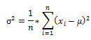

통계학
=======================================

## 1. 통계학의 이해
>###    1. 통계학
        1. 통계학을 공부하는 이유
            * 통계자료 = 신뢰성
            * 의사 결정에 필요한 근거자료 제시
            * 현상 분석하여 실증 자료 제시
        2. 통계학의 정의
            * 수량적 비교를 기초로 많은 사실을 관찰하고 처리하는 방법을 연구하는 학문
            * 관찰 및 조사로 얻을 수 있는 데이터의 의미를 찾고 실행활에 응용
        3. 모집단과 표본
            1. 모집단
                * 통계분석을 적용할 관심 대상의 전체 집합
            2. 표본
                * 모집단을 대표할 조사 대상을 추출한 모집단의 일부
        4. 기술통계 / 추론통계
            1. 기술통계
                * 그래프 / 수치화된 자료를 활용해 집단 특성 설명
            2. 추론통계
                * 표본을 활용해 모집단의 특성 추정
>###    2. 통계분석
        1. 과정
            * 자료의 수집 -> 자료의 정체 -> 추정 -> 검정
        2. 자료 수집
            * 조사 과정에서 자연스레 수집
            * 특정 목적에 맞는 자료를 얻기 위해 설계한 수집도구 이용
                예) 설문조사
        3.자료 정제
            * 분석에 적합한 자료 선별
            * 적합치 않은 자료 삭제
        4. 추정 및 검정
            1. 추정
                * 표본으로 모집단의 특정 추정
            2. 검정
                * 주장이나 믿어지는 사실이 실제인지 검정
        5. 한계
            1. 확률이 없으면 의미가 없음
            2. 틀릴 가능성이 항상 내포
            3. 결론이 언제나 추론
>###    3.모집단과 표본
        1. 모수
            * 모집단을 분석함으로써 얻게되는 통계량
        2. 표본 통계량
        3. 표본 추출
            1. 표본추출
                * 확률적 표본추출
                    - 표본이 뽑힐 확률이 동일
                * 비확률적 표본추출
                    - 표본이 뽑힐 확률이 동일하지 않음
                * 표본의 수가 적어도 추출 방식에 따라 더 정확한 결과를 얻을 수 있다.
            2. 확률적 표본출출 방법
                * 단순 무작위 표본추출
                * 체계적 표본추출
                    - 일정한 간격에 따른 표본 추출
                        예) 1번, 11번, 21번, 31번...
                * 비례 층화 표본추출
                    - label에 따른 전체 모집단의 수에 비례하게 표본을 뽑고 조사
                * 다단계 층화 표본 추출
                    예) 단과대학별로 뽑고 1/2/3/4학년에 대해 표본 추출
            3. 비확률적 표본추출 방법
                * 편의 표본추출
                    - 조사자의 임의대로 원하는 장소에서 원하는 방식으로
                    - 오류가 많을 수 있으며 신뢰도가 떨어짐
                * 판단 표본추출
                    - 어떤 방식으로 표본 추출할지 판단한 다음 표본추출
                    - 자의적
                * 할당 표본추출
                    - 특성별로 집단을 나눈 다음 할당하여 표본 추출
                        예) 갤럽의 여론조사 방식
                * 자발적 표본추출
                    - 지원자에 대한 표본 조사
>###    4.데이터와 통계량
        1. 데이터의 수집
            1. 변수
                * 조사 목적에 따른 대응관계에 따라, 또는 주어진 환경에 따라 변화하는 수
                - 변수의 종류
                    * 질적변수(성질 비교)
                    * 양적변수(산술가능 / 측정단위)
                - 척도
                    * 범주형(명목척도, 서열척도)
                        - 서열척도는 순서의 의미가 있음.
                        - 그러나 둘 다 산술적인 의미는 없음.
                    * 연속형(등간척도, 비율척도)
                        - 산술계산 가능 / 비율척도는 절대적인 0이 존재
                        - 등간척도의 예 : 온도
                        - 비율척도는 비율 적용이 가능함.
            2. 데이터
                * 표본으로부터 수집된 자료(변수 기반)
        2. 데이터의 표현 방법
            1. 기술통계(descriptive)
                * 자료 형태 - 도수표, 파이도, 막대그래프, 히스토그램 등
                * 수치화된 기술통계량 - 평균, 중앙값, 분산, 표준편차
            2. 자료형태
                * 도수분포표 : 자료를 겹치지 않는 범주로 구분, 각 범주에 속하는 자료수(도수)를 표로 나타냄
                    - 단점 : 숫자를 일일이 확인
                * 히스토그램
                * 줄기잎그림
                    예 : 숫자의 십의 자리를 줄기, 1의 자리를 잎으로 표현해 각 숫자가 얼마나 분포하는 지 알 수 있따.
                * 그래프 : 크기나 형태로 바로 비교 가능
        3. 기초 통계량
            1. 중심경향도
                * 평균
                    - 가장 많이 활용되는 중심경향도
                    - 이상값(outlayer)가 있으면 편의가 심하게 발생할 수 있음
                    - 절단 평균 : 최대/최소값을 절단한 후 나머지를 가지고 평균분석
                    - 혹은 반대로 최대/최소값의 인접 값을 채워서 구하는 방식도 있음.
                    - robust통계 : 이상값이 있어도 합당한 결과를 낼 수 있음.
                * 중앙값
                    - 이상점에 대한 영향이 적음.
                * 최빈값
                    - 사용에 한정적
                    - 존재하지 않을 수 있음.
                    - 여러개가 존재할 수 있음.
            2. 산포도(퍼져있는 정도)
                * 범위 : 최대값 - 최소값, 이상값에 취약함.
                * 백분위값(percentile)
                * 사분위값(quartile)
                * 사분위범위(interquartile, IQR) : 극단치를 제외한 사이의 범위를 나타냄.
                * 분산
                    - 모분산

                    
                    - 표본분산
                        - n-1을 반영해 계산
                        - 자유도 : 분산을 구하면서 평균을 구하기 위해 사용된 자료를 제외(고정된 값)
                    - 모표준편차
                        
                    - 표본표준편차
## 2. 확률과 통계
>###    1. 확률과 의사결정
        1. 통계의 목적
            - 모수 추정
            - 추정의 이유
            - 모집단 대상 조사 대체로 불가능.
        2. 표본공간
            - 통계실험이나 조사에서 모든 가능한 결과들의 모임
                예) 한 개의 주사위 던져 나오는 눈
                    * S = {1,2,3,4,5,6}
            - 이산표본공간 / 연속표본공간
            - 사건(event)
        3. 확률
            * 일정 조건 하에서 동일한 실험 지속적 N회 반복시 사건 A가 n번 발생할 가능성
            * 확률의 조건 : 0~1사이의 값을 가지며, 모든 사건의 합은 1
            * 확률의 덧셈법칙 : P(A∪B)=P(A)+P(B)-P(A∩B)
            * 조건부확률 : P(B|A)=P(A∩B)/P(A)
            * 독립사건 : P(A)와 P(B)가 있을 때 하나의 event의 발생이 다른 event에 영향을 주지 않는 경우
                - P(A | B) = P(A)
                - P(A n B) = P(A) * P(B)
>###    2. 확률변수의 기대값과 분산
        1. 기대값
            * E(X)는 event x가 일어날 확률에 x의 값을 곱한 것을 전체 event에 대해 합한 것.
            * 기대값 성질
                - E(a) = a
                - E(aX) = aE(X)
                - E(X + Y) = E(X) + E(Y)
                - E(aX + bY) = aE(X) + bE(Y)
        2. 표본공간(Sample space)
            * 통계실험 / 조사에서 모든 가능한 결과물의 모임
        3. 확률변수
            * 이산확률변수
            * 연속확률변수
            * 확률변수의 분산
                - 기대값으로부터 벗어나 있는 정도.

                
                성질
                    * Var(a) = 0
                    * Var(aX) = a^2Var(X)
                    * Var(X+Y) = Var(X) + Var(Y) + 2Cov(X,Y)
                    * Var(X+Y) = Var(X) + Var(Y)  == X, Y가 독립
                    * Var(X-Y) = Var(X) - Var(Y) - 2Cov(X,Y)
                    * Var(X-Y) = Var(X) - Var(Y)  == X, Y가 독립
>###    3. 확률분포
        1. 정의
            - 미래에 발생할 사건에 대해 확률을 나열한 것.
            - 정보의 양이 많을 수록 의사결정에 도움이 된다.
        2. 분포 종류
          -이산확률분포
            1. 균등분포
                - 과거의 경험이 미래 예측에 어떤 영향도 없으며 나타날 가능성이 모두 동일
            2. 표준정규분포
                - 서로 다른 정규분포 비교하도록 하나의 기준으로 재배치한 표준화된 분포
            3. 이항분포
                - 베르누이 분포
                    * 베르누이 시행을 확률분포로 나타낸 것.
                    * 서로 반대인 사건이 일어나는 실험을 반복적으로 실행.
                    * 성공확률이 p인 경우 실패확률은 1-p
                    u = E{X) = 1 * p + 0 * (1-p) = p
                    σ^2 = Var(X) = E(X^2) - [E(X)^2]
                        = E(x-μ)(x-μ) - p^2
                        = E(x^2 - 2xμ + μ^2) - p^2
                        = E(x^2) - 2E(xμ) + E(x) - p^2
                        = E(x^2) - 2E(x)*E(x) + E(x) - p^2
                        = 0^2 * p^0(1-p)^(1-0) + 1^2 * p^1 * (1-p)^(1-1) - p^2 = p-p^2 = p(1-p)
                        = pq
                - 이항분포 
                    * n번의 시행에서 성공확률(p)이 r번 나타날 확률
                    * 조합 nCr로 표현할 수 있다.(n번 시행 중 r번 관찰)
            4. 포아송분포
                - 특정한 사건이 발생할 가능성이 매우 드문 경우의 확률분포
                - 일정한 시간과 공간 내에 발생하는 사건의 발생횟수
                - 말을 타는 횟수(n) 중 말에서 떨어지는 사고가 발생한 횟수(x)
          -연속확률분포
        3.중심극한정리
            - 표본의 개수가 충분하다면 모수를 모르는 상황에서도 표본통계량으로 정규분포를 구성해 분석할 수 있다.
        4. 표본분포
            1. 정규분포
                - 표본 30개 이상시 가능(일반적)
                - 표본분포 중 가장 단순하고 많이 나타나는 형태
                - 특정 사건이 발생한 분포가 중심을 기준으로 좌우 대칭
            2. Z분포
                - 평균을 0으로, 분산을 1로 만들어 나타내는 분포
            3. t분포
                - 정규분포와 유사한 형태
                - 표본의 개수가 줄어들면 중심이 낮아지고 분포의 꼬리가 넓어짐.
            4. 카이제곱 분포
                - 1개 집단
                - 분산이 퍼져있는 모습을 나타낸 분포
            5. F분포
                - 2개 집단의 분산을 비교시에 사용
                - 분산을 추정 및 검정시에 사용하는 분포
                - 3개 이상의 집단의 분산을 분석하는 분산 분석에 많이 쓰임.
                - 카이제곱 분포와 유사함.
## 3.추정
>###    1. 점추정과 구간추정
        1. 점추정
            * 모수를 특정한 수치로 추정
            - 바람직한 점추정량 조건
                * 평균 오차제곱 : 최소값이어야 함.
                * 불편성 : 추정량이 모수와 같아야
                * 일치성 : 표본 크기가 모집단 규모에 근접해야
                * 유효성 : 분산이 최소값 이어야
                * 충분성 : 표본이 모집단의 대표성을 가져야
        2. 구간추정
            * 모수를 최소값과 최대값의 범위로 추정
            - 사용이유
                * 조사자의 입장에서 오차를 줄이기 위해 명확한 수치를 제시하는 점추정 대신 신뢰도를 제시하여 상한값 / 하한값으로 모수 추정하는 구간추정 사용
            - 신뢰구간
                * 상한값과 하한값의 구간으로 표시, 신뢰수준을 기준으로 추정된 점으로부터 음(-)의 방향과 양(+)의 방향으로 하한 / 상한 표시
>###    2. 모평균의 구간추정
        1. 모집단의 표준편차를 아는 경우
            
        2. 모집단의 표준편차를 모르는 경우(현실적)
        
>###    3. 모집단 비율 및 분산의 구간 추정
        1. 모집단 비율의 구간
            - 표본비율(p(hat))에 대한 신뢰구간을 의미
            - 표본을 추출시, 표본의 개수 n중에서 특정 사건 t가 발생하는 비율
            - 표본의 크기 결정
                * 신뢰구간의 오차한계에 따라 개수 결정.
        2. 모집단 분산의 구간
            - 분산은 평균 / 비유로는 알 수 없는 분포의 특성을 설명해줌. 의사결정에 중요한 기준
            - 분산을 분포로 나타낸 것이 카이제곱분포
                * 정규분포를 이루는 모집단조차 분산 분포는 카이제곱분포.
## 4. 가설검정
>###    1. 가설검정과 유의수준
        1. 가설
            - 주어진 사실 혹은 조사하고자 하는 사실이 어떠하다는 주장 / 추측
            - 귀무가설 : 기존에 받아들여지고 있던, 인정되고 있는 주장, 사실
            - 대립가설
        2. 검정
            - 양측검정
                * '사실이 아니다' 라는 것을 검정하여 귀무가설 기각하고 대립가설을 채택코자 하는 것.
            - 단측검정
                * 조사의 목적에 따라 대립가설을 한쪽만 살핌.
        3. 오류 : 모수를 추정한 결과가 실제와 다른 결론에 도달하는 것.
            - 1종 오류
                * 기존의 가설이 맞는데 틀렸다고 주장하는 내용을 채택하는 오류
            - 2종 오류
                * 귀무가설을 기각해야 함에도 귀무가설을 기각하지 않는 오류
            - 일반적으로 1종 오류를 저지를 가능성을 낮추는 것이 일반적.
            - 그러나, 1종 오류 가능성을 낮추면 2종 오류 가능성은 높아짐.
        4. 검정력
            - 1종오류의 경우 유의수준 α 로 표시
            - 2종오류의 경우 확률 β로 표시
            - 가설의 검정력 : 1-β
            
>###    2. 모집단 평균의 가설검정
        1. 가설수립
        2. 유의수준 결정
            - 모분산 아는 경우
                * 정규분포
            - 모분산 모르는 경우
                - 표본이 큰 경우
                    * 정규분포
                - 표본이 작은 경우
                    * t분포
        3. p값을 이용한 가설검정
            - p값 : 귀무가설을 기각하기 위한 최대한의 한계점을 의미. p값이  α 보다 작으면 귀무가설 채택
            - 기존의 유의수준으로 채택/기각하는 방식����� 강도를 표현하기에 충분치 않음.
>###    3. 모집단 비율 및 분산의 가설검정
        1. 비율 가설검정
        2. 분산 가설검정
            - 평균에 대해 어느 정도의 산포가 나타나는지 살펴보는 가설검정
## 5. 같은 두 모집단의 실험 전 후 간의 추론
>###    1. 두 모집단의 평균 차이에 대한 가설검정(대응표본)
        1. 대응표본
            * 모집단 A / 모집단 B를 연관 지어 추출 하고 비교
            * 대응표본 t분포
>###    2. 두 모집단의 평균 차이에 대한 가설검정(독립표본)
            * 두 모집단의 표본을 뽑고 독립 표본의 표본 개수, 분산의 동일성 여부에 따라 구분
            - 구분
                * 표본 개수 충분, 모분산 동일
                    - 정규분포로 분석
                * 표본 개수 충분, 동일성 모르는 경우
                    - 정규분포와 비슷하다고 가정하고 분석
                * 표본 개수 불충분, 모분산 동일
                    - 합동 분산 추정량 : 서로 독립적인 모집단들의 공통 분산의 불편추정량으로 나타낸다.
                * 표본 개수 불충분, 모분산 동일성 모르는 경우
            가정 : 두 모집단이 정규분포이거나 정규분포와 비슷
                
>###    3. 두 모집단의 비율 차이에 대한 가설검정