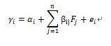

## 3. 자산가격결정모델
>###    1. 차익거래모형
            - CAPM은 자산수익률의 분포가 정규분포라는 가정 또는 투자자의 효용함수가 2차형이어야 한다는 가정이 성립하는 경우의 균형가격졀정모형이다.
            - 그러나 이러한 가정은 현실과 상당히 거리가 있음.
            - 증권시장선의 문제는 모든 위험자산의 시장포트폴리오에 대한 정보, 기대수익률 및 표준편차의 자료를 알아야 한다는 한계점이 있음.
            - 따라서 시장포트폴리오를 사용치 않고 개별증권의 균형가격을 결정하는 원리를 설명하는 모형중 하나가 APM, 즉 차익거래모형임.
            1. 차익거래가격결정이론(APT)
                * 가정
                    - 무위험자산 고려 x
                    - 투자자들은 동질적 미래기대
                    - 시장은 완전자본 시장, 거래비용, 소득세 없고 이자율이나 물가의 변동도 없음.(모든 제도적 요소 무시)
                    - 증권시장은 수요와 공급이 일치하는 균형상태
                    - 자산수익률 생성함수는 다음과 같이 다중 요인 모형임.
                        * R_j = E(R_j) + b1j * F_1j + ... + b_kj * F_kj + ϵ_j
            2. 차익거래포트폴리오
                - 현재 특정 포트폴리오를 구성해 자산 보유중인 투자자가 기존 자산 중 특정 자산을 매각 후, 그 매각 대금으로 동일 금액의 다른 자산을 매입해 추가 위험 부담 없이 포트폴리오를 새롭게 구성하는 과정 - 차익거래
                - 이를 통해 구성된 새로운 포트폴리오가 차익거래포트폴리오
                * 차익거래이익
                    - 이러한 추가적 비용 부담 없이 추가적 위험도 부담 없는 상태에서 추가적 이익이 발생시 그 이익을 차익거래이익이라고 함.
                * 균형상태에서의 차익거래이익
                    - 만약 균형상태라면 추가적 비용 부담 없이 추가 위험 없으면 추가적 이익이 없음.
                    - 즉, 균형상태에서 차익거래이익은 평균적으로 0
            3. APM의 장점
                - CAPM은 APM의 특수한 형태
                - CAPM은 단일기간 모형이며, APM은 다기간모형으로 확장 가능
                - CAPM은 수익률분포가 정규분포라는 가정과 투자자의 효용함수가 2차형이라는 가정을 하지 않아도 성립
                - CAPM은 모든 위험자산으로 구성된 시장포트폴리오에 의해서 설명되나, APM은 소수의 자산집합에 대해서도 성립
                - APM은 시장포트폴리오를 사용치 않아도 되니, 시장포트폴리오에 대한 효율성 검증이 필요 없음
                - APm은 무위험자산을 고려하지 않아도 성립
            4. APM의 단점
                - 요인의 객관적 의미를 알 수 없음. 연구자에 따라 주관적 결정
                - 실증검증의 겨로가 구해진 요인의 적정 개수를 알 수 없음.
>###    2. 자본 자산 결정 모델
        * 가정
            - 개인 투자자들은 가격 순응자
            - 단일 투자 기간
            - 투자는 금융 자산 거래로 제한
            - 세금과 거래 비용 x
            - 정보는 비용없이 모두에게 공유
            - 투자자는 이성적으로 평균 분산 분석 시행
            - 동일한 기대값을 가짐.
            1. 자본 자산 결정 모형(CAPM)
                - 모든 투자자가 보유한 위험 자산 포트폴리오는 시장 포폴
                - 시장포폴은 모든 증권 포함
                - 각 증권 비율은 시장 가격 대비 비율
                - 시장의 리스크 프리미엄은 평균적 투자자들 위험 회피에 비례
                - 균형 : 시장 리스크 프리미엄과 각 증권의 리스크 선형 식으로 표현
                * 리스크(β_i)
                    - COV_i,m : 증권의 수익과 시장 수익간 공분산
                    - Var_m : 시장 수익률의 분산
                    - β_i = COV_i,m / Var_m
                    - 주식의 주익률과 시장 포폴 수익률 간의 민감도
                    - 특정 증권의 베타는 해당 증권이 시장 포폴 리스크를 얼마나 증가시키는 지 보임
                    - 체계적인 리스크가 높아질 수록 시장은 더 높은 수익률을 준다고 명시
                    - 비체계적 리스크는 분산 투자를 통해 리스크 프리미엄 제거 가능
                * SML : 증권시장선
                    - CAPM은 균형 상태시 모든 증권은 증권 시장선 위에 위치
                    - 시장에서 증권 수익률이 CAPM의 수익률보다 높은 경우 모든 투자자는 증권의 수익률을 낮춰 포폴 구성 요소들을 수정
            2. 재정 가격 결정이론(APT)
                - 각기 다른 증권의 수익률을 나타낼 때 사용
                - 차익 기회가 없으면 자산의 기대 수익률은 다수 요인들 간의 선형 결합을 통해 표시
                - 요인들은 거시 경제적 요인 혹은 시장 지표임. 각자의 베타 계수 존재
                a_i : 증권 i를 나타내는 상수
                β_ij : 증권 i와 요인 j 간의 민감도
                F_j : 체계적요인(없앨 수 없음)
                e_j : 평균이 0인 비체계적 리스크
                
                * 요인포트폴리오 : 오직 하나의 요인에만 반응할 정도로 잘 분산된 포트폴리오
                    - 다른 요인에 대한 베타 값 0
                    - 특정 요인 베타 값 1
                    - 무차익 거래를 사용해 잘 분산된 포트폴리오의 리스크 프리미엄은 요인 포트폴리오의 리스크 프리미엄 가중합과 같음
                    RP_j : 리스크 프리미엄 요인
                    β_i : 민감도요인
                - 지수모델 : 시장 포트폴리오 수익률 하나만으로 요인으로 사용하는 재정 가격결정이론
                - CAPM : 재정가격결정이론에서 개별증권 α_i = 0 인 경우
            3. CAPM과 APT의 차이점
                - CAPM은 경제적 관점의 균형 모델 / 기대수익률, 민감도 베타를 모든 증권에 명시 가능
                - APT 는 차익 거래를 사용한 통계적 모델 / 거의 모든 증권에 기대수익률, 베타를 명시 가능
                - 시장에서 가격이 잘못 책정된 경우, APT는 일부 투자자만 포트폴리오 수정, CAPM은 모든 투자자가 포트폴리오 수정