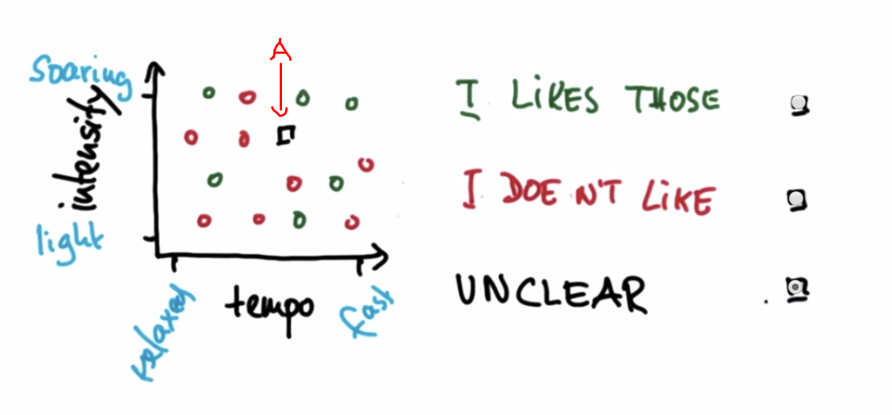

머신러닝 수업 정리
=================
1. Supervised Classfication
    - supervised classification이란?
        - supervised는 수많은 example이 주어지면 해당 example들에 대한 
        합당한 대답을 얻을 수 있다는 의미다.
        - 예시
            - 자율주행자동차 : 예를 들어, 황량한 사막에서 운전하는 것은 일반적인 도로와는 다를 것이다. 따라서, 사막에서의 운전에 대한 example을 만들어 그를 학습시키고 적당한 운전방법을 알아내도록 만들 수 있다.
            - tag된 사진들에서 특정한 사람 찾아내는 것. : 이는 페이스북에서 실제로 하고 있는 방식
            - 특정인의 음악 choice를 통해 특징을 분석하고 추천하는 것.
        - 반례(unsupervised classification)
            - 이상한 거래내역을 통해 사기꾼인지 판별하는 것 : 이는 이상한 거래라는 것의 의미를 부여할 필요가 있고, 그를 위한 충분한 example이 필요할 것이기 때문
            - 학생들의 type을 고려하여 수업 매칭 : 얼마나 많은 타입이 있을 지 알 수 없다. 즉, 기준이 될 example을 구할 수 없다.
    - Acerous VS non-Acerous 예제
        - 기린은  Acerous?
        - 그룹으로 지어진 동물들로 미루어 볼 때 각각의
attribute가 다르다. 
        - 기린은 acerous가 아니다.
    - Features and Labels
        - 음악 호불호 알아내기
            - 음악의 feature가 tempo와 intensity로 이루어져 있다고 가정한다.
            - 각 feature의 정도에 따라 호불호에 대한 명확한 label이 지어진다고 가정한다.
            - 이에 따라 아래의 이미지 처럼, intensity와 tempo의 2가지 diagram에 의해 명확하게 호불호가 갈린다고 볼 때, A로 표시된 부분의 음악의 호불호를 예측해본다.
            - 완벽하진 않지만, 아마 다른 음악의 결과에 based하여 해당 음악을 좋아할 것이라고 판단할 수 있을 것이다.
            - 
            - 만약 아래의 이미지와 같다면 예측이 가능할까??
            - unclear라고 대부분 생각할 것이다.
            - 
            - 언제나 명확한 결과를 예측할 수 있을까?
        - 차량의 속도 조절
            - 울퉁불퉁한 정도와 경사정도에 따라 속도를 조절해야 한다고 생각해보자
            - 각각의 환경은 모두 데이터가 된다.(scatter plot)
            - 머신러닝에서 중요한 것은 이를 바탕으로 decision surface를 결정하는 것이다.
            - 두 변수에 따라 어떤 부분에서는 빠르게, 어떤 부분에서는 느리게 가야한다는 것을 결정할 수 있다.
    - Decision surface
        - 서로 다른 feature를 갖는 object를 나누는 기준(일반화가 가능한 기준)
        - 명확히 나눌 수록 좋은 D.S이다.
        - 머신 러닝에서는 DATA를 수집한 다음 그것을 갖고 D.S를 만드는 작업을 한다.
    - NAIVE BAYSE
        - Decision Surface를 결정하는 가장 commonly한 알고리즘이다.
        - Bayse Rule을 기반으로 함. 즉, 특정 분류 섹터에 대한 확률을 계산하여 각 case를 해당 sector로 분류할 수 있다.
        - 예를 들어, 특정 email의 text를 분석하여 누가 보낸 것인지 알려고 한다고 가정한다.
        - 이를 통해서 어떤 word가 쓰였는지 확인하여 누가 쓴 것일지 예측할 수 있을 것이다. 그러나 왜 Naive라고 불리는 것일까
        - 해당 text의 frequency만 판단재료로 쓰이고 order와 같은 다른 중요할 수 있는 관련 변수를 사용하지 않기 때문이다.
        - 장점
            - Sector가 여러 개인 Multi-Sector 데이터 Set인 경우 해당 분류가 매우 쉽고 빠름
            - 독립이라는 가정이 성립 시에, 학습 결과가 좋으며, 필요 데이터량도 적어짐
            - 수치형 데이터보다 범주형 데이터에 효과적
        - 단점
            - 학습 데이터에는 없고 실험 데이터에는 있는 경우 "zero frequency"가 되어 확률이 0이므로 정상적인 분류가 안된다.
            - 데이터가 독립이라는 가정이 현실에서 적용되지 않는 경우가 더 많아, 실질적인 사용에 어려움
            - 독립이 아닐 경우, 결과에 대한 신뢰성이 떨어짐
    - Gaussian NB
        - Python의 sklearn이라는 library에 존재함.
        - <a href="http://scikit-learn.org/stable/modules/generated/sklearn.naive_bayes.GaussianNB.html">참조</a>
        - 해당 라이브러리를 이용하여 Decision Surface를 규정하고 예측을 시도해볼 수 있다.
        - GaussianNB.py를 참조한다.
        - 우선 library를 import하고 생성자를 만든다. `clf = GaussianNB()`
        - 그리고 실제 학습시킬 자료를 fit시킨다. 첫 인자는 feature이며, 두 번째는 label이다.
        - 이를 통해 알고리즘 내부에서 Decision Surface를 읽어낸다.
        - 그 후, predict함수를 이용하여 특정 사례들을 예측할 수 있다.
        - sklearn의 metrics 라이브러리에서 accuracy_score를 import하고, 해당 함수를 이용해 정확도를 측정할 수 있다.
    - overfit problem
        - 특정 data를 통해 training을 시켰다면 반드시 다른 데이터로 테스트를 해야만 한다.
        - 이는 매우 중요한데, 만약 하지 않을 경우 해당 learning은 training data에 매우 overfit하게 될 것이기 때문이다.
        - 현실에서 실제 일어나는 상황이 아닌 training data에 biased된 결과를 읽어낼 수 있다.(새로운 데이터에 대해서도 일반화가 가능해야 한다.)
    - Bayse Rule
        - Bayse가 만들어낸 규칙이다. 이는 통계학과 AI에 큰 영향을 미쳤음.
        - Cancer test의 예시
            - 암에 걸려있을 확률 prior possibility : p(c) = 0.01
            - test evidence
                - 암에 걸려 있는 사람을 positive라고 판단할 확률 : p(P | c) = 0.90 (Sensitivity)
                - 암에 걸려 있지 않은 사람을 negative라고 판단 : p(N | ~c) = 0.90 (specificity)
            - posterior possibility
                - positive결과인 개체가 실제 cancer에 걸린 경우 : p(c | p) / { p(c | p) + p(~c | p)} = 0.009 / (0.009 + 0.099) = 0.0833333%
        - 위 예시가 바로 Bayse Rule의 기본 개념이다.
            - prior possibility * test evidence(여기서는 +였지만 현실은 대체로 *) => posterior possibility
            - 즉, 사후확률을 사전확률과 우도(likelyhood probability)를 이용하여 구할 수 있다는 것이다.
        - add up to 1 : normalize인데, p(p | c) + p(p | ~c)를 의미. 반드시 1이 되는 것은 아니다. 그러나 사후 확률을 정확하게 구하기 위해서 진행된다.