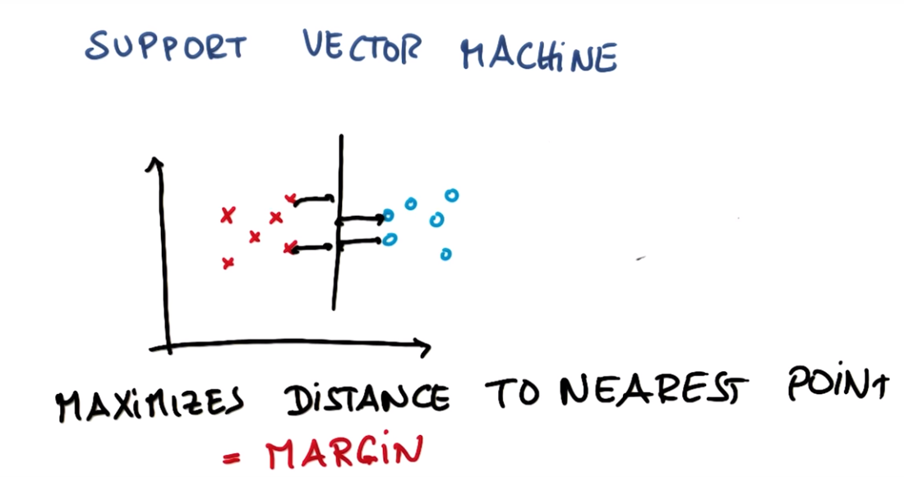
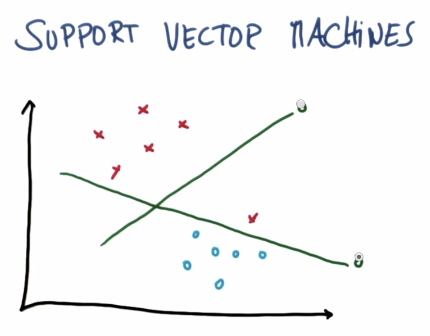
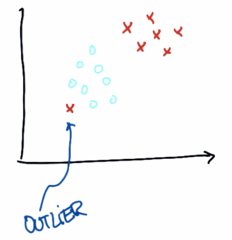
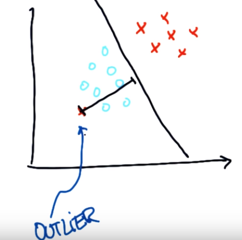

### SVM
- Support Vector Machine으로 매우 powerful한 알고리즘이다.
- 해당 알고리즘은 우선 분류를 올바르게 해내고 Margin을 극대화 시키는 방식으로 진행된다.
- Margin이란? 분류할 수 있는 경계와 표본과의 거리를 의미함. 이를 극대화
  - 
  - 이와 같이 각 Class 사이의 가장 가까운 지점 과의 거리(Margin)을 최대화해야 한다.
  - 똑같이 분류를 하더라도, 복수의 Class에 대해서 Classfication을 진행 시, 해당 Error에 대해 Robustness를 최대화할 수 있어야 한다.
  - Margin(with Robustness) 최대화 예시
    - 
    - 이 경우에 있어서 위로 솟아 있는 Line은 Margin은 최대화 하더라도, Classification Error를 발생시킨다.
    - SVM은 우선 Classification을 시행한 이후, 해당 제약을 기반으로 Margin을 최대화하기 때문에 아래 쪽의 Line이 SVM이 Construct하는 Line이라고 생각할 수 있다.
- Outlier가 있는 경우. Outlier와 같은 이상치에 의해 완벽하게 분류해내지 못할 수 있다. 이런 경우 SVM은 가능한 한 가장 좋은 방법을 찾는다.
  - 
  - 이와 같이 Classification에 Error를 유발할 수 있는 Outlier가 있을 수 있다.
  - 
  - 이 경우에는 위 사진 처럼, 최대한 Clearance를 유지하여 Data set을 분류하도록 지정한다. 그리고 Individual Outlier에 대해서 Tolerate하고 Outlier에 의해 영향 받은 점을 표시하도록 할 수 있다.
  - SVM은 Outlier를 ignore하여 robust하게 유지할 수 있음. Margin 최대화 / Outlier ignore를 조정하여 비록 Tradeoff이지만, 어느 정도로 이상치를 한정할지는 SVM Parameter에 의해 결정된다.
- <a href="http://scikit-learn.org/stable/modules/generated/sklearn.svm.SVC.html">library참조</a>
- 